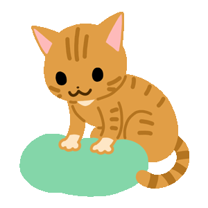

# 第二天 - 桌面小圖示(一) - 第一支 electron 應用程式

不知道有沒有人記得 Word 的小助手 `迴紋針`


今天我們也來用 Electron 做一個小助手 😁

首先 , 放上目標成果

預計效果


小貓 - 可愛吧 😁 , 

[](https://i.imgur.com/6O1RzBu.gif)

[圖片來源 - ilikesticker.com](https://www.ilikesticker.com/LineStickerAnimation/W550562-Ginger-Cat-Animation/zh-Hant)

下面開始動手製作 

第一步 , 下載專案模板 

```shell script
# 複製 Quick Start 儲存庫
$ git clone https://github.com/electron/electron-quick-start

# 進到儲存庫裡
$ cd electron-quick-start

# 安裝相依的套件並執行
$ npm install && npm start
```

第二步 , 將可愛的貓咪載入

```html=
<!DOCTYPE html>
<html>
<head>
    <meta charset="UTF-8">
    <!-- https://developer.mozilla.org/en-US/docs/Web/HTTP/CSP -->
    <meta http-equiv="Content-Security-Policy" content="default-src 'self'; script-src 'self'; style-src 'unsafe-inline'">
</head>
<body>
    
</body>
</html>
``` 

第三步 , 隱藏工具列與標題列 , 並將背景透明化

new BrowserWindow 時 , 建立參數
- `frame`           : 標題列不顯示
- `transparent`     : 背景透明
- `autoHideMenuBar` : 工具列不顯示
  
```javascript=
const mainWindow = new BrowserWindow({
    width: 350,
    height: 350,
    webPreferences: {
        preload: path.join(__dirname, 'preload.js'),
    },
+   frame: false,          // 標題列不顯示
+   transparent: true,     // 背景透明
+   autoHideMenuBar: true  // 工具列不顯示
});
``` 

第四步 , 讓圖片可以用滑鼠抓著移動

在 body 標籤上追加 `style="-webkit-app-region: drag"`

```html=
<!DOCTYPE html>
<html>
<head>
    <meta charset="UTF-8">
    <!-- https://developer.mozilla.org/en-US/docs/Web/HTTP/CSP -->
    <meta http-equiv="Content-Security-Policy" content="default-src 'self'; script-src 'self'; style-src 'unsafe-inline'">
</head>
<body style="-webkit-app-region: drag">
    
</body>
</html>
``` 

第五步 , 讓圖片無法選取

在 body 標籤上追加 `style="user-select: none"`

```html=
<!DOCTYPE html>
<html>
<head>
    <meta charset="UTF-8">
    <!-- https://developer.mozilla.org/en-US/docs/Web/HTTP/CSP -->
    <meta http-equiv="Content-Security-Policy" content="default-src 'self'; script-src 'self'; style-src 'unsafe-inline'">
</head>
<body style="-webkit-app-region: drag;user-select: none">
    
</body>
</html>
``` 


如果做不太出來 , 可以下載 [第 2 天成品](https://github.com/andrew781026/ithome_ironman_2020/tree/master/day-02) 然後用 `npm start` 看到玩耍的小貓 

## 備註

如果想要從 ilikesticker 使用其他小貓 , 
可以用 [ezgif.com](https://ezgif.com/loop-count) 將小貓的動作次數改成 0 - 無限次


## 參考資料

- [Electron 官網](https://www.electronjs.org/)


```
今年小弟第一次參加 `鐵人賽` , 如文章有誤 , 請各位前輩提出指正 , 感謝  <(_ _)>
```