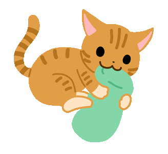

# [ Day 4 ] - 桌面小圖示(三) - 鍵盤快速鍵與更多的貓咪

如果昨天沒有做出來 , 可以從 [第 3 天成品](https://github.com/andrew781026/ithome_ironman_2020/tree/master/day-03) 然後用 `npm start` 看到無限的神奇狗 

-----

只有一隻貓咪 , 或是一隻狗狗 , 好像`療癒系數`不太夠用 , 今天我們加碼更多的貓咪

[下載 貓咪 GIFs](https://github.com/andrew781026/ithome_ironman_2020/tree/master/day-04/imgs)

說明 : 今天利用鍵盤 ctrl+1 ~ 6 控制貓咪圖片 1 ~ 6 的顯示

| 快捷鍵    |   圖片    | 
| -------- | -------- | 
| ctrl+1   |   | 
| ctrl+2   |   | 
| ctrl+3   |   | 
| ctrl+4   |   | 
| ctrl+5   |   | 
| ctrl+6   |   | 

成果長成這樣


希望有許多可愛的貓咪在桌面嗎 ? 讓我們動手開始做吧 ! 

第一步 , 複製昨天的 index.html . package.json 與 main.js , 並安裝第三方套件

```shell script
# 安裝 package.json 中紀錄的第三方套件
$ npm i 
```

第二步 , 引入 globalShortcut 與 node.js API 的 path 套件

```javascript
// main.js
const app =  require('electron').app; // app 就是 Main Process 自身
const BrowserWindow = require('electron').BrowserWindow; // 瀏覽器視窗
+ const globalShortcut = require('electron').globalShortcut; // 全域快捷鍵
+ const path = require('path'); // node.js API 的 path 套件
```

第三步 , BrowserWindow 追加 preload 

```javascript
// main.js
const mainWindow = new BrowserWindow({
    width: 1000,  // 寬度
    height: 650, // 高度
+    webPreferences: {
+        preload: path.join(__dirname, 'preload.js'),
+    },
    frame: false,      // 標題列不顯示
    transparent: true, // 背景透明
    autoHideMenuBar: true, //  工具列不顯示
});
```

第四步 , createWindow 函式 , 回傳 mainWindow , 並將寬高修改成合適的大小

```javascript
// main.js
function createWindow() {

    const mainWindow = new BrowserWindow({
        width: 400,   // 寬度
        height: 380,  // 高度
        webPreferences: {
            preload: path.join(__dirname, 'preload.js'),
        },
        frame: false,      // 標題列不顯示
        transparent: true, // 背景透明
        autoHideMenuBar: true, //  工具列不顯示
    });

    mainWindow.loadFile('index.html');

+    return mainWindow;
}
```

第五步 , 用 globalShortcut 註冊 ctrl+1 ~ 3 時的行為 , 

```javascript
// main.js
app.on('ready', () => {

    const win = createWindow();

+    [1, 2, 3].map(number => {
+
+        globalShortcut.register(`CommandOrControl+${number}`, () => {
+            win.webContents.send('switch-cat', number); // 觸發  preload.js 中的 ipcRenderer.on('switch-cat' 事件
+            win.show();  // Shows and gives focus to the window.
+        })
+    })
})
```

第六步 , 修改 index.html 的 img 追加 id="img" , 並修改預設圖片

```html
<!-- index.html -->
- 
+ 
```

第七步 , 建立 preload.js

```javascript
// preload.js
const {ipcRenderer} = require('electron');

window.addEventListener('DOMContentLoaded', () => {

    const img = document.getElementById('img');
    const switchCat = number => img.src = `imgs/cat_0${number}.gif`;

    ipcRenderer.on('switch-cat', (event, args) => switchCat(args));
});
```

然後 , 只要應用程式開著 ctrl+1 ~ 3 都會切換貓咪圖片 , 並將應用程式帶到畫面最上面


如果我們希望當應用程式不再最上面時 , 按鍵 ctrl+4 ~ 6 不會有任何反應 , 我們可以直接在 index.html 使用 js 控制 keyup 動作即可

> 我們引入 mousetrap.js 輔助我們更簡單的控制組合按鍵

修改 index.html 

```html
<!-- index.html -->


<!-- 追加 js script 在最底端 -->
+ <script src="https://craig.global.ssl.fastly.net/js/mousetrap/mousetrap.min.js?a4098"></script>
+ <script>
+
+    const img = document.getElementById('img');
+    const switchCat = number => img.src = `imgs/cat_0${number}.gif`;
+
+    [4, 5, 6].map(number => {
+
+        // 將不同的組合鍵對應到同一個 callback
+        Mousetrap.bind([`command+${number}`, `ctrl+${number}`], () => {
+
+            switchCat(number);
+
+            // 回傳 false 防止預設行為被觸發，並避免事件向外傳遞
+            return false
+        })
+    })
+ </script>

</body>
```

之後 `npm start` 我們就可以 ctrl+1 ~ 6 切換不同的可愛貓咪了 ! 


## 參考資料

- [Electron 文件 - keyboard-shortcuts](https://www.electronjs.org/docs/tutorial/keyboard-shortcuts)

```
今年小弟第一次參加 `鐵人賽` , 如文章有誤 , 請各位前輩提出指正 , 感謝  <(_ _)>
```
